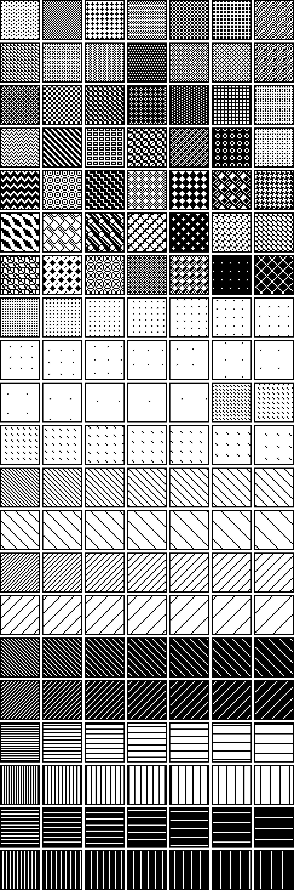
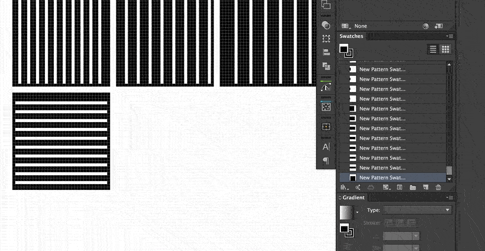

# Illy Dithers

**Adobe Illustrator pixel perfect dither patterns.**

I’ll be adding more as time goes on.

## Usage

Open this file via swatches flout menu.

More detailed instructions coming soon.

## Development

The main goal is to make sure everything is snapped to a whole pixel; in the above example, I had to adjust the pattern bounding box and the vector’s alignment to the pixel grid.

If done properly, the patterns should look exactly the same in pixel and normal preview modes.

---

To the extent possible under law, [@mhulse](https://github.com/mhulse) has waived all copyright and related or neighboring rights to this work.

